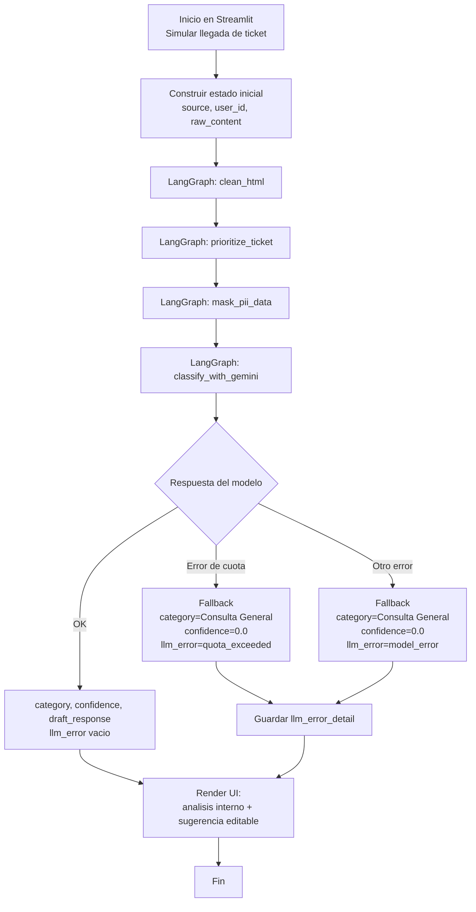

# Clasificacion Etiquetas Borrador

Aplicación de soporte técnico con `Streamlit + LangGraph + Gemini` para clasificar tickets, priorizar urgencias, enmascarar PII y sugerir un borrador de respuesta.

## Características

- Pipeline orquestado con LangGraph.
- Limpieza de HTML y sanitización de entrada.
- Detección de urgencia para posibles casos de fraude.
- Enmascaramiento de datos sensibles (correo, tarjeta, teléfono).
- Clasificación con salida estructurada usando Gemini.
- Manejo robusto de errores de IA con fallback controlado:
  - `llm_error`: código de error resumido.
  - `llm_error_detail`: mensaje técnico completo para depuración.
- Simulación de múltiples escenarios de ticket desde la UI.

## Estructura

```text
.
├── main.py
├── src/
│   ├── api/
│   │   └── mock_webhook.py
│   └── agents/
│       └── support/
│           ├── agent.py
│           ├── state.py
│           └── nodes/
│               ├── limpiador/node.py
│               ├── priorizador/node.py
│               ├── mascara/node.py
│               └── llm_gemini/
│                   ├── node.py
│                   └── prompt.py
├── test_modelos.py
├── pyproject.toml
└── .env
```

## Requisitos

- Python 3.10+
- `uv`
- API key de Gemini en `.env`

## Configuración

Crea o actualiza `.env`:

```env
GOOGLE_API_KEY=tu_api_key
GEMINI_MODEL=gemini-flash-lite-latest
```

## Ejecución

```bash
uv sync
uv run streamlit run main.py
```

## Ver modelos disponibles para tu API key

```bash
uv run python test_modelos.py
```

## Escenarios mock incluidos

- Email: Fraude urgente.
- Chat: Doble cobro.
- WhatsApp: Cancelación de suscripción.
- Chat: Bug difuso en la app.
- Email: Consulta cotidiana.

## Flujo del agente

1. `clean_html`
2. `prioritize_ticket`
3. `mask_pii_data`
4. `classify_with_gemini`

## Diagrama de flujo



## Manejo de errores IA

Cuando el modelo falla (por cuota, modelo no disponible u otro error), el nodo de Gemini devuelve una salida de respaldo:

- Categoría: `Consulta General`
- Confianza: `0.0`
- Borrador: respuesta manual sugerida
- `llm_error`: `quota_exceeded` o `model_error`
- `llm_error_detail`: detalle técnico para revisar en UI

Esto evita que la aplicación se caiga y permite continuar con operación manual.
